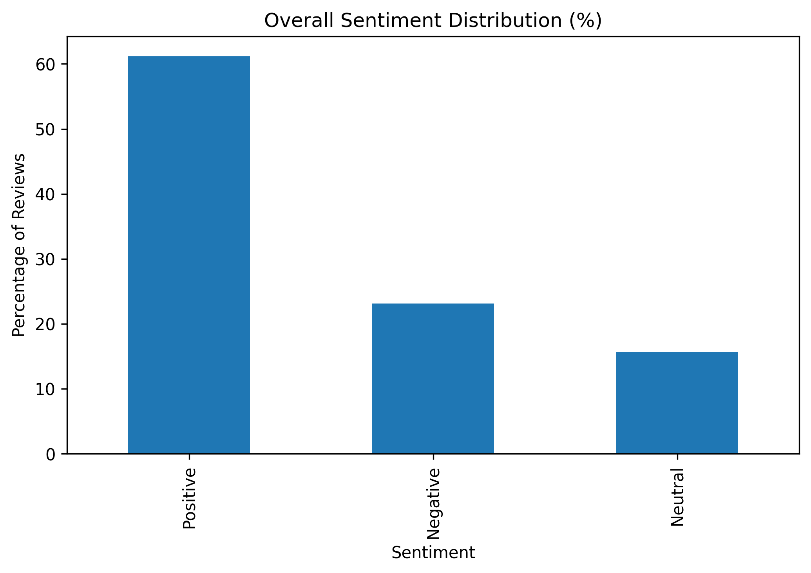
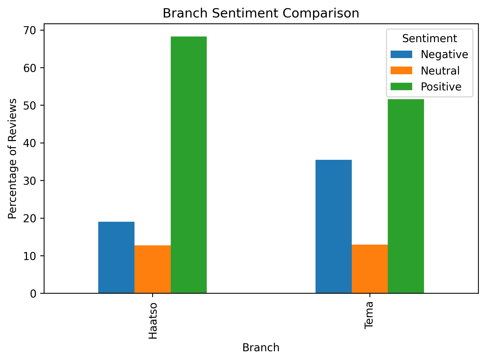
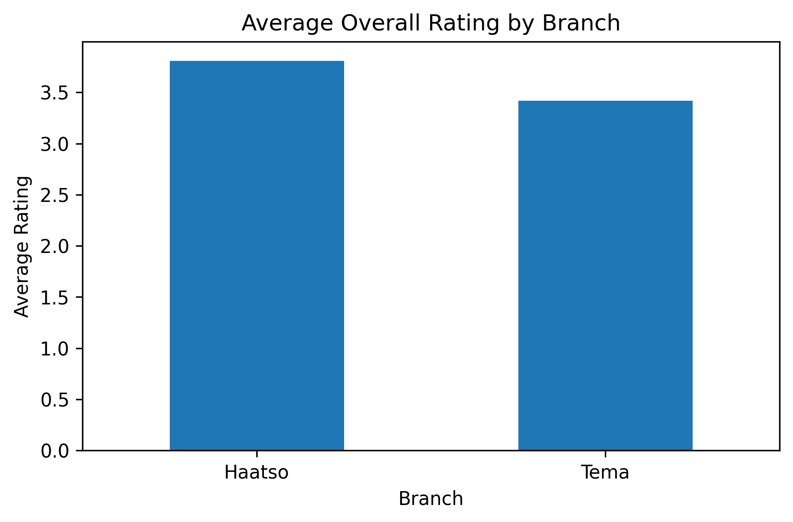
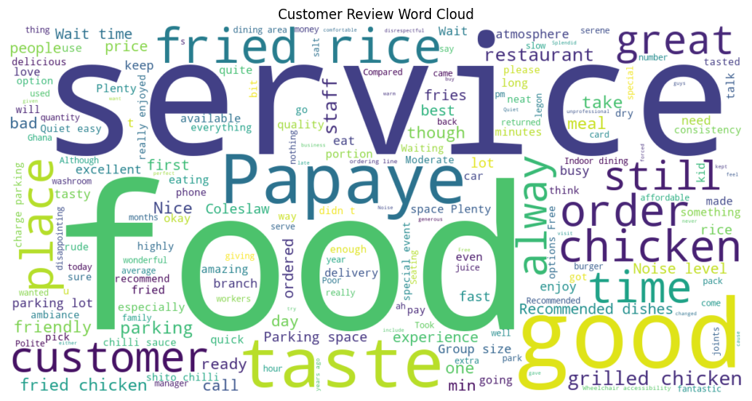

# Customer Review Sentiment Analysis: Papaye Fast Foods

## Project Overview

This project analyzes customer reviews from the Haatso and Tema branches of Papaye Fast Foods using sentiment analysis and business analytics techniques.

The objective was to understand customer sentiment, identify customer satisfaction drivers, uncover recurring customer concerns, and generate actionable business recommendations.

This project was conducted as a practical application of customer experience analytics, natural language processing (NLP), and data-driven decision-making using publicly available customer reviews.

---

## Business Problem

Customer reviews contain valuable information about customer experiences, satisfaction levels, and operational performance.

However, manually reviewing large volumes of customer feedback can be time-consuming and inefficient.

This project demonstrates how sentiment analysis can transform customer feedback into actionable business insights that support customer experience management and continuous improvement.

---

## Dataset

### Source

Publicly available Google Reviews

### Branches Analyzed

- Haatso Branch
- Tema Branch

### Dataset Size

- 134 customer reviews

---

## Methodology

The project followed a five-step analytical process:

1. Customer Review Collection
2. Data Cleaning and Preparation
3. Sentiment Analysis using VADER
4. Branch Performance Evaluation
5. Business Recommendations

---

## Tools and Technologies

- Python
- Pandas
- NLTK
- VADER Sentiment Analyzer
- Matplotlib
- WordCloud
- Jupyter Notebook
- Microsoft Excel

---

## Key Findings

### Overall Customer Sentiment

| Sentiment | Percentage |
|------------|------------|
| Positive | 61.19% |
| Negative | 23.13% |
| Neutral | 15.67% |

### Branch Performance Ratings

| Metric | Haatso | Tema |
|----------|----------|----------|
| Overall Rating | 3.81 | 3.42 |
| Food Rating | 3.68 | 3.46 |
| Service Rating | 3.55 | 3.21 |
| Atmosphere Rating | 3.85 | 3.52 |

### Key Customer Satisfaction Drivers

- Food Quality
- Fried and Grilled Chicken
- Family-Friendly Atmosphere
- Parking Availability
- Brand Reputation

### Key Customer Pain Points

- Waiting Time
- Slow Service
- Product Availability
- Food Consistency
- Excessive Seasoning

---

## Business Recommendations

1. Improve Service Speed During Peak Hours
2. Strengthen Inventory Management
3. Standardize Food Preparation Processes
4. Continue Investing in Customer Experience
5. Implement Ongoing Customer Review Monitoring

---

## Project Visualizations

### Overall Customer Sentiment



### Branch Sentiment Comparison



### Branch Performance Ratings



### Customer Review Word Cloud



---

## Project Structure

```text
papaye-customer-sentiment-analysis/

├── data/
├── notebook/
├── images/
├── outputs/
├── presentation/
├── requirements.txt
└── README.md
```

---

## Author

Richard Adutwum

MSc Marketing

Customer Experience | Marketing Analytics | Data Analytics

---

## Disclaimer

This project was conducted independently for educational and portfolio purposes using publicly available customer reviews. The analysis and recommendations reflect the author's interpretation of the data and do not represent the official views of Papaye Fast Foods.